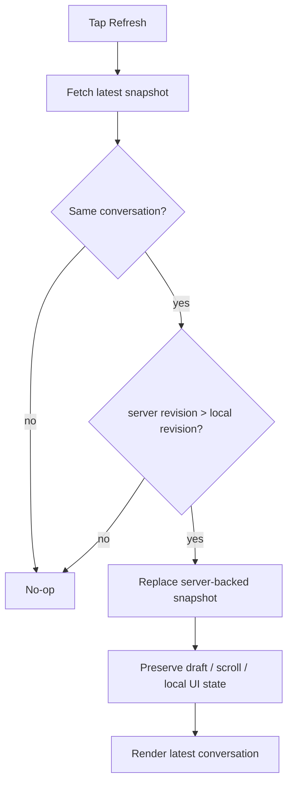

# ChatGPT Conversation Refresh — minimal semantic PoC

A tiny Swift proof-of-concept for an iOS **Refresh Conversation** action whose meaning is deliberately narrow:

> Fetch newer server state for the currently open conversation, reconcile it into the local view, and preserve local-only UI state. Do not generate, send, branch, or mutate canonical conversation content.

This repository is **not** ChatGPT source code and does not use private ChatGPT APIs. It demonstrates the behavior contract only.

## Why

A mobile conversation can visibly lag behind server state. Restarting the app may cause the completed server-side state to appear, which suggests a useful product primitive: expose a safe, explicit read-only refresh without requiring an app restart.

## Semantic contract

`Refresh Conversation` MUST:

- fetch the latest state for the current `conversation_id`;
- act as a no-op if the server revision is not newer;
- update server-backed messages when a newer revision exists;
- preserve unsent draft text;
- preserve scroll position/anchor where possible;
- preserve local UI state while reconciliation occurs;
- be idempotent for the same server revision.

It MUST NOT:

- send a user message;
- regenerate an assistant response;
- create a new conversation;
- branch the conversation;
- discard unsent text;
- overwrite the UI with an older server revision.

## State transition



## MVCA-style interpretation

The action is observation/reconciliation only:

```text
Observe server state
        ↓
Validate conversation identity + monotonic revision
        ↓
Reconcile local projection
        ↓
Render

NO generation authority
NO send authority
NO canonical mutation authority
```

## Run

```bash
swift test
swift run refresh-demo
```

The executable demonstrates local revision `104` refreshing to server revision `105` while preserving an unsent draft, scroll anchor, and local streaming UI state.

## Files

- `Sources/RefreshCore/Conversation.swift` — state model
- `Sources/RefreshCore/ConversationRefresher.swift` — refresh contract
- `Tests/RefreshCoreTests/...` — acceptance tests
- `Examples/RefreshConversationButton.swift` — minimal SwiftUI control
- `FEATURE_REQUEST.md` — product-ready proposal text

## Non-goals

This PoC intentionally does not guess ChatGPT's private endpoint shape, internal persistence model, stream protocol, or revision mechanism. In a production app the `ConversationFetching` implementation would reuse the application's existing conversation-fetch path.

## Acceptance matrix

See [`ACCEPTANCE.md`](ACCEPTANCE.md) for the compact behavior matrix used to keep refresh semantics read-only and idempotent.

## Community submission

[`COMMUNITY_POST.md`](COMMUNITY_POST.md) contains a ready-to-post proposal that links this PoC to the iOS feature request discussion.

## Verification

Validated locally with Swift 6.2 using:

```bash
swift test
swift run refresh-demo
```

No private ChatGPT API, endpoint, token, or application source code is included in this repository.
